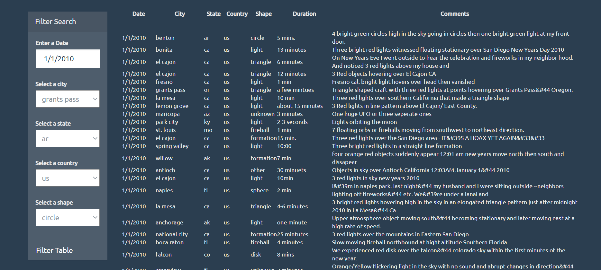

# javascript-challenge
This is a project to filter data dynamically based on the search criteria selected in the web page.
It adds rows of data to the webpage table after filtering it from the given dataset. 

The project contains 2 folders. First one contains an html page with a simple filter where users can input a date and filter the UFO data and the sightings for that date will be displayed. The second folder provides the UFO data based on multiple filters. Users can input a date and select a city, state, country, and shape from the respective dropdowns. The sightings based on these filters will be displayed in the webpage. 

The filters and results look as following. 

